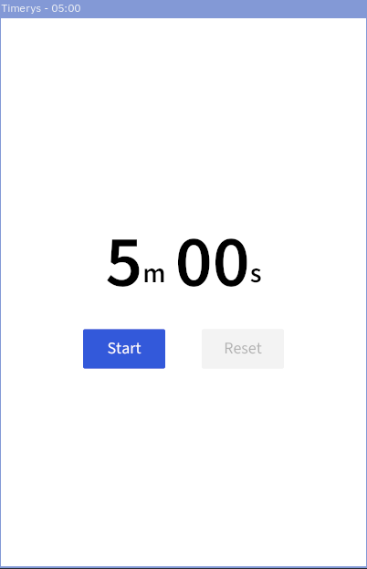
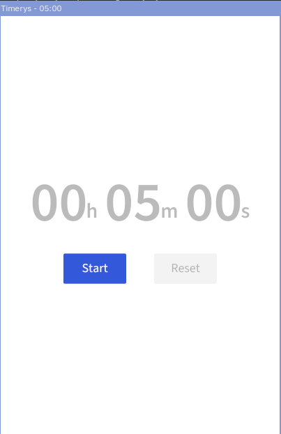

# Timerys

A simple cross-platform timer app. Created as a study of [iced](https://github.com/iced-rs/iced) and because I
wanted a very simple timer application.

This can be a lot prettier but some cosmetic details I want to add are not easy to do in iced as of writing -
though I imagine it'll get better soon!

## Thanks/credits

- Design based on Google's built-in timer utility if you search for a timer.
- Default alarm is pulled from [AOSP's timer app](https://github.com/aosp-mirror/platform_packages_apps_alarmclock/blob/72a37ccef83271f175c94b71f2d0abac8b4aefa4/res/raw/in_call_alarm.ogg).
- Font is [Source Sans 3](https://fonts.google.com/specimen/Source+Sans+3).
